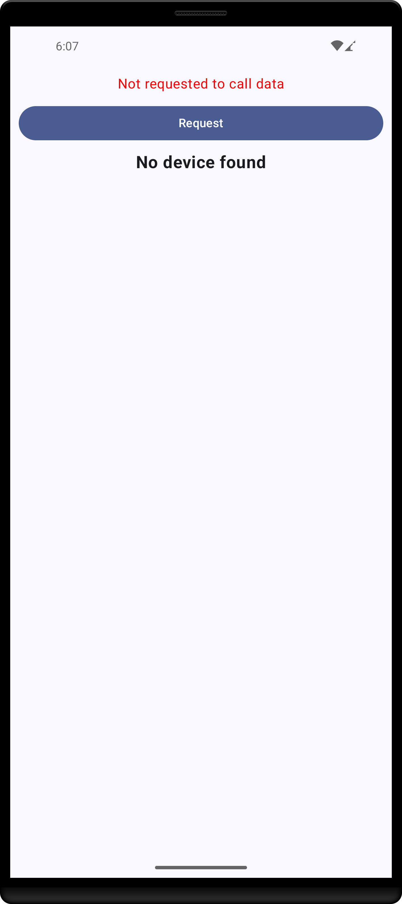
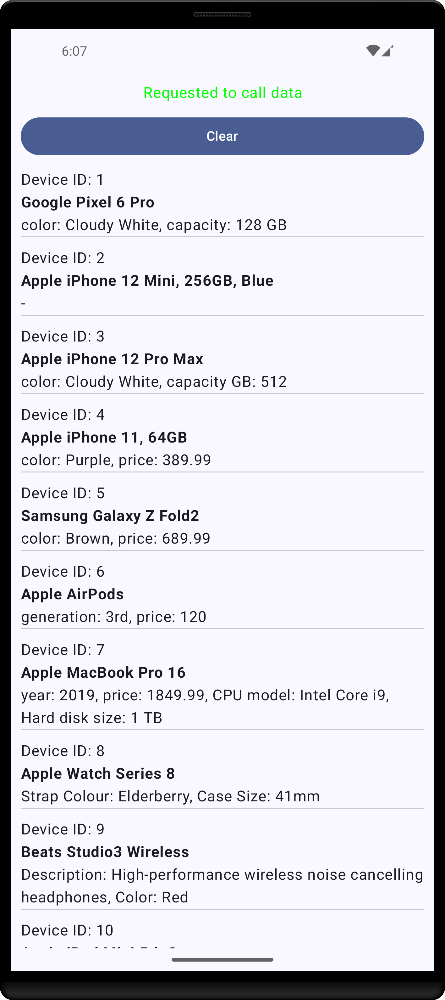

# Compose Clean Architecture

This is an simple application Android application which developed by using Jetpack Compose in Kotlin language.
The application follows clean architecture with MVVM pattern.



The application is composed of main screen where there is a button and after clicking that button `timeToRequest` variable's
value is changed. When the value of the variable the system requests data.

The date first requested from API, then the response is written into database. After inserting the data to database, the data called back from database to present them to user.
If there is will not be internet connection the app will work offline.



The application implements:
- Dagger Hilt for dependency injection
- Room for database management
- Retrofit for API calls

## API

The data is taken from https://api.restful-api.dev/objects

```json
[
    {
        "id": "1",
        "name": "Google Pixel 6 Pro",
        "data": {
            "color": "Cloudy White",
            "capacity": "128 GB"
        }
    },
    {
        "id": "2",
        "name": "Apple iPhone 12 Mini, 256GB, Blue",
        "data": null
    },
    {
        "id": "3",
        "name": "Apple iPhone 12 Pro Max",
        "data": {
            "color": "Cloudy White",
            "capacity GB": 512
        }
    },
    {
        "id": "4",
        "name": "Apple iPhone 11, 64GB",
        "data": {
            "price": 389.99,
            "color": "Purple"
        }
    },
    {
        "id": "5",
        "name": "Samsung Galaxy Z Fold2",
        "data": {
            "price": 689.99,
            "color": "Brown"
        }
    },
    {
        "id": "6",
        "name": "Apple AirPods",
        "data": {
            "generation": "3rd",
            "price": 120
        }
    },
    {
        "id": "7",
        "name": "Apple MacBook Pro 16",
        "data": {
            "year": 2019,
            "price": 1849.99,
            "CPU model": "Intel Core i9",
            "Hard disk size": "1 TB"
        }
    },
    {
        "id": "8",
        "name": "Apple Watch Series 8",
        "data": {
            "Strap Colour": "Elderberry",
            "Case Size": "41mm"
        }
    },
    {
        "id": "9",
        "name": "Beats Studio3 Wireless",
        "data": {
            "Color": "Red",
            "Description": "High-performance wireless noise cancelling headphones"
        }
    },
    {
        "id": "10",
        "name": "Apple iPad Mini 5th Gen",
        "data": {
            "Capacity": "64 GB",
            "Screen size": 7.9
        }
    },
    {
        "id": "11",
        "name": "Apple iPad Mini 5th Gen",
        "data": {
            "Capacity": "254 GB",
            "Screen size": 7.9
        }
    },
    {
        "id": "12",
        "name": "Apple iPad Air",
        "data": {
            "Generation": "4th",
            "Price": "419.99",
            "Capacity": "64 GB"
        }
    },
    {
        "id": "13",
        "name": "Apple iPad Air",
        "data": {
            "Generation": "4th",
            "Price": "519.99",
            "Capacity": "256 GB"
        }
    }
]
```